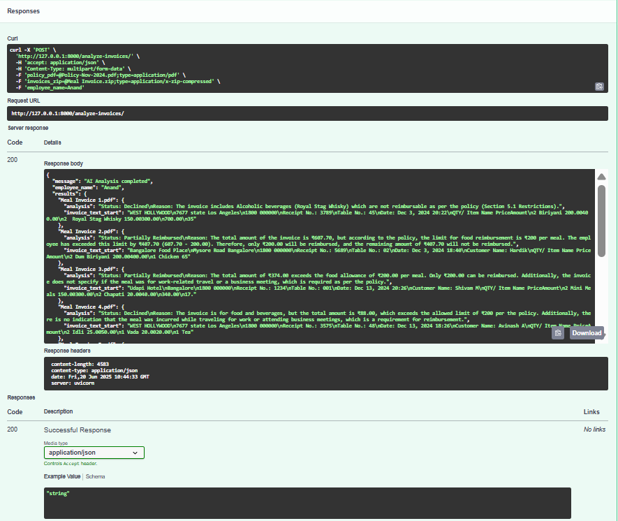
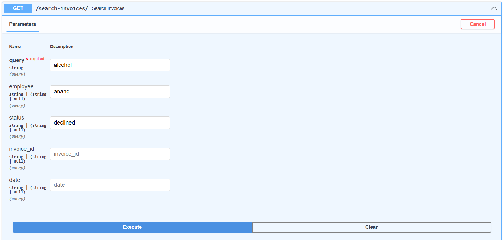

# 🧾 AI/ML Invoice Reimbursement System

## 🚀 Project Overview

This project automates the invoice reimbursement workflow using Large Language Models (LLMs) and semantic search. It allows users to upload invoice PDFs and an HR policy document, analyzes the invoices using Groq LLM based on the policy, and classifies them as **Fully Reimbursed**, **Partially Reimbursed**, or **Declined** — with reasons.

The results are stored as vector embeddings in **ChromaDB**, enabling Excel export and chatbot-based querying via **Streamlit**.


The results are stored as vector embeddings in **ChromaDB**, enabling Excel export and chatbot-based querying via **Streamlit**.

---

## 🎯 Objectives

- Automate invoice validation using LLMs
- Store invoice metadata in a vector DB (ChromaDB)
- Provide Excel export functionality
- Enable chatbot interaction for querying past invoices
- Add user login, admin dashboard, and session tracking

---
## 🧩 System Modules

### 🔹 1. `analyze-invoices`: Invoice Reimbursement API (FastAPI)
- Upload an **HR Policy PDF**
- Upload a **ZIP file of invoice PDFs**
- Provide **employee name**
- Each invoice is:
  - Analyzed using Groq LLM
  - Classified into: Fully / Partially / Declined
  - Stored in ChromaDB with metadata

### 🔹 2. `export-excel`: Export to Excel
- Download all invoice records as `.xlsx`
- Includes: employee, status, reason, and snippet

### 🔹 3. `search-invoices`: Metadata-Aware Search API
- Accepts `query`, `employee`, `status`, `invoice_id`
- Returns matching documents based on:
  - semantic similarity (via vector embedding)
  - metadata filtering (employee, status, etc.)

### 🔹 4. Unified Streamlit Interface
- Tabs: 📤 Upload & Analyze, 💬 Chatbot, 📊 Admin Dashboard (for admin)
- Sidebar:
  - Login/logout session tracking
  - Filters (employee/status) shown only in chatbot tab
- Chatbot supports:
  - “Which invoices contain alcohol?”
  - “Show declined invoices by Shreya”
- Admin dashboard allows:
  - Viewing all records
  - Excel download
  - Role-based access control

---

## 🔐 Login Credentials

| Username | Password  | Role     |
|----------|-----------|----------|
| admin    | admin123  | Admin    |
| anand    | emp123    | Employee |
| shreya   | emp456    | Employee |

---

## 🧰 Tech Stack

| Component       | Technology             |
|----------------|------------------------|
| Backend         | FastAPI                |
| Frontend        | Streamlit              |
| LLM API         | Groq (Mixtral / LLaMA3)|
| Embeddings      | Sentence-Transformers  |
| Vector DB       | ChromaDB               |
| PDF Parsing     | PyPDF2                 |
| Excel Export    | pandas + openpyxl      |
| File Uploads    | python-multipart       |

---

## 📁 Folder Structure


```
invoice-reimbursement/
├── app.py                    ← Streamlit UI
├── main.py                   ← FastAPI backend
├── requirements.txt
├── README.md
├── utils/
│   ├── pdf_parser.py
│   ├── batch_parser.py
│   ├── shared_invoice_utils.py
│   └── logger.py
├── llm/
│   ├── groq_analyzer.py
│   └── llm_chat.py
├── vector_store/
│   ├── db.py
│   └── embedder.py
├── uploads/                  ← temp storage
└── .env                      
```

---

## ⚙️ Installation & Setup

1 Clone the Repository:

```

git clone https://github.com/Prathme07/invoice-reimbursement.git

```
2 Navigate to the Project Directory:
```
cd invoice-reimbursement
```
3 Create a Virtual Environment

```
python -m venv venv
```
4 Activate the Virtual Environment
```
venv\Scripts\activate     # Windows
```

OR

```
source venv/bin/activate  # Linux/macOS
```
5 Install Dependencies
```
pip install -r requirements.txt
```

---


6 Set Up Environment Variables

Create a `.env` file and set your Groq API key:

```env
GROQ_API_KEY=your-groq-key-here
```

Or use:

```
export GROQ_API_KEY=your-groq-key-here  # macOS/Linux
```
```
set GROQ_API_KEY=your-groq-key-here     # Windows
```

---

## ▶️ Running the App

### 🔹 FastAPI Backend

```
uvicorn main:app
```

Visit:  
[http://localhost:8000/docs](http://localhost:8000/docs)

---

### 🔹 Streamlit Frontend

```
streamlit run app.py
```

Visit:  
[http://localhost:8501](http://localhost:8501)

---

## 📦 API Guide

### POST `/analyze-invoices/`
- Inputs: `policy_pdf` (PDF), `invoices_zip` (ZIP), `employee_name` (string)
- Output: JSON result per invoice with:
  - `Status`: Fully / Partially / Declined
  - `Reason`: Explanation from LLM

### GET `/export-excel/`
- Downloads `.xlsx` with all analyzed invoices

### GET `/search-invoices/`
- Inputs: `query` + optional `employee`, `status`, `invoice_id`
- Output: matched invoices with metadata

---

## 🤖 Prompt Design

### Invoice Analysis Prompt

```
You are an invoice checker.

Policy:
{policy_text}

Invoice:
{invoice_text}

Task:
Is the invoice valid as per the policy?
Reply in this format:
Status: Fully Reimbursed / Partially Reimbursed / Declined
Reason: <why?>
```

### Chatbot Prompt (RAG Style)

```
You are a smart and helpful assistant trained to analyze and explain employee invoice reimbursements.

Your task is:
1. Understand the user's question.
2. Refer to the documents provided.
3. Respond with clear and structured answers in **Markdown** format.
```

---

## 📚 How Vector DB Works

Each invoice is embedded using `sentence-transformers` and stored in ChromaDB with metadata:

- `employee`
- `status`
- `reason`
- `invoice_id`
- `text`

Then queried using hybrid of vector similarity + metadata filtering.


---

## 📷 Sample Screenshots


### Web Interface

A single web interface for both upload and analysis of invoices, admin panel and a chatbot

Upload & Analysis Tab:


---

ChatBot Tab:


---

Admin Panel:

This panel will not be visible for employee


---

### API Response Example

Invoices Analysis:


---
Response of Invoices Analysis in JSON:



---

Search Invoices:



---

Response of Search Invoices:


---

### Excel Export Example
Excel Response in FastAPI:


### 

---

## ✅ Final Notes

- 🔐 No invoice data is stored permanently
- 💬 Easy to extend with more LLM providers or advanced filtering

---


