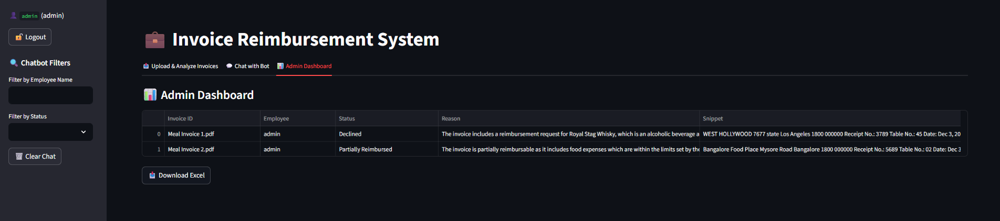

# 🧾 AI/ML Invoice Reimbursement System

## Project Overview

This project automates employee invoice reimbursement analysis by leveraging Large Language Models (LLMs). It parses invoice PDFs and checks them against HR policy to determine if they are fully reimbursed, partially reimbursed, or declined — with reasons. It uses vector embeddings to store invoice data and allows both Excel export and chatbot interaction.

Built with **FastAPI**, **Groq (LLM)**, **ChromaDB (vector DB)**, **Streamlit**, and **Python**.

---

## Objectives

- ✅ Automate invoice review using LLMs
- ✅ Store results in a vector store for search and filtering
- ✅ Export results in a clean Excel format
- ✅ Optional: Chatbot querying via Streamlit

---

## Features

### 1. Invoice Analysis API (`/analyze-invoices/`)
- Upload an HR **policy (PDF)**
- Upload a **ZIP of invoice PDFs**
- Provide the **employee name**
- For each invoice:
  - Classify: Fully Reimbursed / Partially / Declined
  - Provide reason based on policy
- Store results + vector embeddings in **ChromaDB**

### 2. Excel Export API (`/export-excel/`)
- Returns a `.xlsx` file containing:
  - Invoice filename
  - Status
  - Reason
  - Employee name
  - Text snippet

### 3. Streamlit Chatbot (`chatbot_app.py`)
- Ask invoice-related queries in natural language
- Responses are generated using Groq LLM + ChromaDB context
- Example queries:
  - “Why was Invoice 3 declined?”
  - “How many invoices were fully reimbursed?”

---

## Tech Stack

| Area             | Tool/Tech                          |
|------------------|------------------------------------|
| Language         | Python                             |
| API Framework    | FastAPI                            |
| LLM Integration  | Groq (Mixtral 8x7b via API)         |
| PDF Parsing      | PyPDF2                             |
| Embeddings       | Sentence-Transformers              |
| Vector Store     | ChromaDB                           |
| Excel Export     | Pandas + openpyxl                  |
| Chatbot UI       | Streamlit                          |

---

## Folder Structure


```
invoice-reimbursement/
├── main.py
├── requirements.txt
├── README.md
├── utils/
│ └── pdf_parser.py
├── llm/
│ └── llm_analyzer.py
├── vector_store/
│ ├── db.py
│ └── embedder.py
├── uploads/
│ └── (temporary files saved here)

```

---

## Installation

```
git clone https://github.com/yourusername/invoice-reimbursement.git
```
```
cd invoice-reimbursement
```
```
python -m venv venv
```
```
venv\Scripts\activate     # For Windows
# OR
source venv/bin/activate  # For Linux/macOS
```
```
pip install -r requirements.txt
```
---
## Environment Setup
Set your API keys securely using environment variables.
```
| Variable Name  |	Description  |
|--------------------------------|
|GROQ_API_KEY	Your | Groq API Key|
```
Windows:
```
set GROQ_API_KEY=your-key-here
```
Linux/macOS:
```
export GROQ_API_KEY=your-key-here
```
---

## Running the Application

### FastAPI Backend
Run on terminal:
```
uvicorn main:app --reload --reload-dir .
```
Then open this in your browser:
```
 http://127.0.0.1:8000/docs
```

### Streamlit Chatbot
Run on terminal:
```
streamlit run chatbot_app.py
```
Then open this in your browser:
```
http://localhost:8501
```
---
## Sample Results

### Excel Export Example


---

### Chatbot Interface Example



---

### API Response Example


---


---

## API Usage Guide


1 /analyze-invoices/ – POST
Use this to analyze invoices.

- policy_pdf: PDF file of HR policy

- invoices_zip: ZIP of invoice PDFs

- employee_name: string

- Returns JSON analysis for each invoice.

2 /export-excel/ – GET
Downloads a .xlsx file with:

- Invoice name

- Analysis

- Employee

- Snippets

---
## Prompt Design


### Invoice Analysis Prompt:

You are a finance auditor. Given a reimbursement policy and an invoice, decide if the invoice is:
- Fully Reimbursed
- Partially Reimbursed
- Declined

Always explain your reasoning using the policy content.


### Vector Store (ChromaDB)


Each invoice's embeddings are stored with metadata:

- filename
- employee
- status
- reason
-invoice_text

This enables similarity search and future chatbot querying.
---
